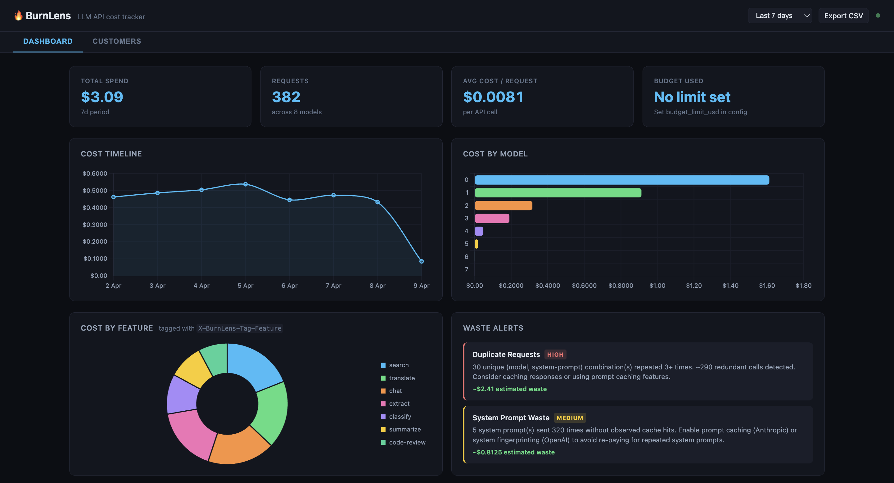

# BurnLens

**See exactly what your LLM API calls cost, per feature, team, and customer.**

[](https://pypi.org/project/burnlens/)
[](LICENSE)

```bash
pip install burnlens
burnlens start
# Dashboard at http://127.0.0.1:8420/ui
```

---

## The Problem

- **OpenAI bills by model, not by feature.** You find out at month end.
- **Reasoning tokens on o1/o3 can cost 10x more than expected.** There's no per-call breakdown in the invoice.
- **One bad deploy can cost $47K before anyone notices.** No alerts, no per-request visibility.

BurnLens is a transparent local proxy that sits between your app and the AI provider. Zero code changes. Full cost visibility.

---

## How It Works

BurnLens runs as a local proxy. Point your SDK at it, and every request is logged with cost, latency, and your custom tags:

```bash
# Start the proxy
burnlens start

# Set the env vars it prints (or add to your .env)
export OPENAI_BASE_URL=http://127.0.0.1:8420/proxy/openai
export ANTHROPIC_BASE_URL=http://127.0.0.1:8420/proxy/anthropic
```

### Google SDK Setup

The Google `generativeai` SDK does not support a base URL env var. Use the patch helper instead:

```python
import burnlens.patch
burnlens.patch.patch_google()   # call once, before any Google API usage

import google.generativeai as genai
r = genai.GenerativeModel("gemini-2.0-flash").generate_content("Hello!")
```

Or configure manually:

```python
import google.generativeai as genai
genai.configure(
    api_key=os.environ["GOOGLE_API_KEY"],
    client_options={"api_endpoint": "http://127.0.0.1:8420/proxy/google"},
    transport="rest",
)
```

Your existing code works unchanged for OpenAI and Anthropic. Add optional tags via headers for per-feature/team/customer tracking:

```python
import openai

client = openai.OpenAI()  # automatically uses OPENAI_BASE_URL

response = client.chat.completions.create(
    model="gpt-4o",
    messages=[{"role": "user", "content": "Hello!"}],
    extra_headers={
        "X-BurnLens-Tag-Feature": "chat",
        "X-BurnLens-Tag-Team": "backend",
        "X-BurnLens-Tag-Customer": "acme-corp",
    },
)
```

---

## What You Get

<!-- Replace with actual screenshot: docs/dashboard.png -->


- **Cost timeline** -- daily spend trend across all providers
- **Cost by model, feature, team, customer** -- know exactly where the money goes
- **Waste alerts** -- context bloat, duplicate requests, model overkill
- **Recent requests** -- per-call cost and latency in real time

### CLI Tools

```bash
burnlens top                    # live traffic viewer (like htop for LLM calls)
burnlens report --days 7        # cost digest report
burnlens analyze                # waste detection + savings suggestions
burnlens export --days 30       # export to CSV
```

---

## Configuration

Create a `burnlens.yaml` in your project root (optional -- everything works with defaults):

```yaml
port: 8420
host: "127.0.0.1"
log_level: "info"

alerts:
  terminal: true
  # slack_webhook: "https://hooks.slack.com/services/T.../B.../xxx"
  budget:
    daily_usd: 5.00
    weekly_usd: 25.00
    monthly_usd: 80.00
```

---

## Supported Providers

| Provider | Env Var | Models |
|----------|---------|--------|
| **OpenAI** | `OPENAI_BASE_URL` | gpt-4o, gpt-4o-mini, gpt-4-turbo, gpt-4, gpt-3.5-turbo, o1, o3, o3-mini, o4-mini |
| **Anthropic** | `ANTHROPIC_BASE_URL` | claude-opus-4-5, claude-sonnet-4-5, claude-3.5-sonnet, claude-3.5-haiku, claude-haiku-4-5, claude-3-opus |
| **Google** | `burnlens.patch.patch_google()` | gemini-2.5-pro, gemini-2.5-flash, gemini-2.0-flash, gemini-1.5-pro, gemini-1.5-flash |

All models with pricing in the provider's pricing file are supported. Unknown models are logged with cost = $0.00 and a warning.

---

## Contributing

We welcome contributions! See [CONTRIBUTING.md](CONTRIBUTING.md) for guidelines.

Run tests with `pytest`. The codebase is Python 3.10+ with type hints throughout.

---

## License

[MIT](LICENSE)
